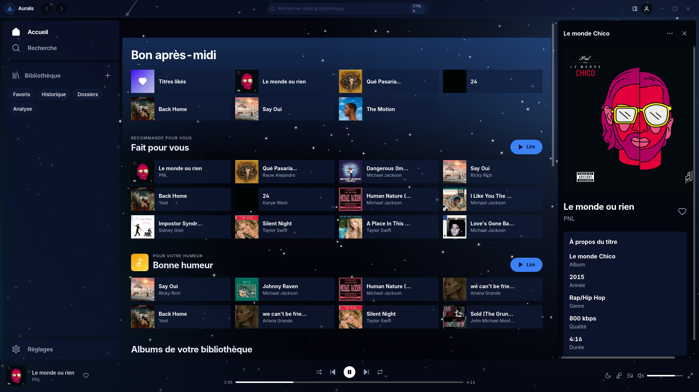
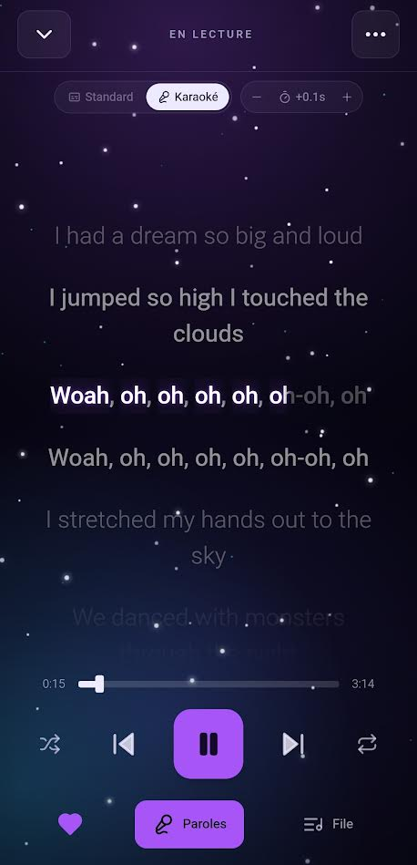

<div align="center">


# AURALIS

### Your music. Your server. Your universe.

The self-hosted music platform that finally feels like it was built for you —
not for an algorithm.

[](https://github.com/ybenyedder/auralis/actions/workflows/ci.yml)
[](https://github.com/ybenyedder/auralis/releases/latest)
[](LICENSE)
[](https://paypal.me/AdamMezerai)

**[Download](https://github.com/ybenyedder/auralis/releases/latest)** &nbsp;·&nbsp;
**[Quick start](#get-started-in-60-seconds)** &nbsp;·&nbsp;
**[Support the project](https://paypal.me/AdamMezerai)**

</div>

---

<div align="center">



<em>One window. Your album art glowing in a field of stars, lyrics lighting up word by word.</em>

</div>

---

## Imagine this

You press play. The room dims into a living starfield. Your cover art breathes at
the center, the lyrics ignite word by word in real time, and the same moment follows
you from your laptop to your phone to your living-room screen — because one server
you own is powering all of it.

No subscription. No ads. No "we've curated this for you." No company logging what you
listen to at 3 a.m. Just your collection, in full fidelity, exactly the way you want
it.

That's Auralis: a music platform that respects your taste and your privacy, and looks
like a flagship app while doing it.

> Auralis is free and open-source. If it gives you that "finally, something made
> right" feeling, a one-time tip keeps it alive — **[paypal.me/AdamMezerai](https://paypal.me/AdamMezerai)**.

---

## Why you'll love it

**Karaoke that actually syncs.** Word-level highlighting with a tunable lead-in. Sing
along like it's a music video — because it basically is.

**A UI that feels premium.** A living starfield backdrop, cover-derived color washes,
twelve hand-crafted themes, smooth animations. It doesn't look self-hosted. It looks
shipped.

**One hundred percent yours.** Local-first. The only request it ever makes is an
optional lyrics lookup, and you can switch even that off. Zero telemetry, forever.

**It reads your library for real.** Real ID3 / Vorbis / MP4 tags, embedded cover art,
bitrate and codec — parsed and indexed into a fast SQLite + FTS5 search engine.

**Lyrics that become yours.** Missing lyrics get fetched from LRCLIB and written back
as `.lrc` files next to your music, so they're self-hosted from then on.

**Everywhere you are.** One server powers a polished web app, a native desktop app
(Linux and Windows), and a native Android app with a real lock-screen notification.

**Built like a product.** Multi-user accounts, scrypt-hashed passwords, rate-limited
login, CSP and security headers, secure range streaming. Serious engineering under a
beautiful surface.

---

## Looks just as good in your pocket

<div align="center">



<em>Native Android client. Real system media notification. Full karaoke view.
Your whole library, one tap away.</em>

</div>

---

## Get started in 60 seconds

```bash
git clone https://github.com/ybenyedder/auralis.git
cd auralis
npm ci
npm run dev          # http://localhost:4237
```

Point it at your music and you're done:

```env
# .env.local
AURALIS_MUSIC_DIR=/absolute/path/to/Music
```

A scan kicks off automatically and streams progress live. For production hosting:
`npm run build && npm start`.

**First login.** Auralis creates an `admin` account on first boot. No password is
hard-coded — it's either your `AURALIS_ADMIN_PASSWORD`, or a random one printed once
to the server logs. Log in, then change it in Settings → Account.

---

## Desktop app (Linux and Windows)

A native Electron shell wrapping the same server in a frameless window with custom
controls and OS media keys.

```bash
npm run desktop:build:linux     # .deb + .AppImage
npm run desktop:build:win       # .exe (installer + portable)
```

Prebuilt installers are attached to each [release](https://github.com/ybenyedder/auralis/releases/latest).

## Android app

A fully native Kotlin/Compose client (`android-native/`, no WebView) that connects
to your self-hosted server. Playback runs on ExoPlayer/media3 with a real system
notification and lock-screen controls — artwork, scrubbing, play/pause/skip — and
the UI renders natively (home, library, player, lyrics, playlists, insights, plus
the personalised recommendations and monthly mood recap).

```bash
npm run mobile:native           # → android-native/app/build/outputs/apk/debug/app-debug.apk
```

Grab the prebuilt APK from the [latest release](https://github.com/ybenyedder/auralis/releases/latest).

> Prefer the browser? The web app is fully responsive and installable as a PWA, so
> opening your server's address on a phone gives the same mobile-styled interface.

---

## Configuration

Everything has a sane default — see [`.env.example`](.env.example).

| Variable | Default | Purpose |
| --- | --- | --- |
| `AURALIS_MUSIC_DIR` | `~/Music` | Library root that's scanned and streamed |
| `AURALIS_DATA_DIR` | platform data dir | SQLite DB + art cache |
| `PORT` | `4237` | Server port |
| `AURALIS_ADMIN_PASSWORD` | random | Seed the admin password |
| `AURALIS_TOKEN` | empty | Require this bearer token on every `/api` call |
| `AURALIS_LYRICS_ONLINE` | `true` | Allow LRCLIB lookups |
| `AURALIS_LYRICS_SIDECAR` | `true` | Write fetched lyrics back as `.lrc` |

---

## Hardened by design

No default password, scrypt-hashed credentials, rate-limited login, signed `httpOnly`
sessions, path-traversal-proof streaming, CSP and security headers on every response,
no wildcard CORS on authenticated routes, and a bounded import endpoint. Found
something? See [SECURITY.md](SECURITY.md).

## Architecture

```
src/server/   framework-agnostic core (config · db · auth · rateLimit · library · lyrics · state)
src/app/api/  thin Next.js route handlers
src/components, store/   the shared UI (powers all three clients)
desktop/      Electron shell    ·    android/ + mobile/www/   native client
```

## Develop

```bash
npm run dev · npm run check · npm test · npm run lint · npm run typecheck
```

---

## Support the project

Auralis is free, ad-free and tracker-free, and it stays that way. If it earns a place
in your day, fuel the next feature with a one-time tip:

<div align="center">

### [paypal.me/AdamMezerai](https://paypal.me/AdamMezerai)

</div>

## Contact

Youssef Ben yedder — [volt@webtvmedia.net](mailto:volt@webtvmedia.net)

## License

[Auralis Attribution License](LICENSE) © Youssef Ben yedder. You're free to use, fork and
build on Auralis — as long as you credit the author and link back. No modifying it
into your own thing without the tag.
