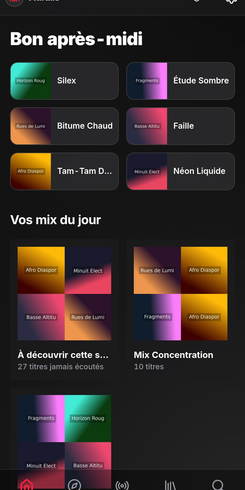
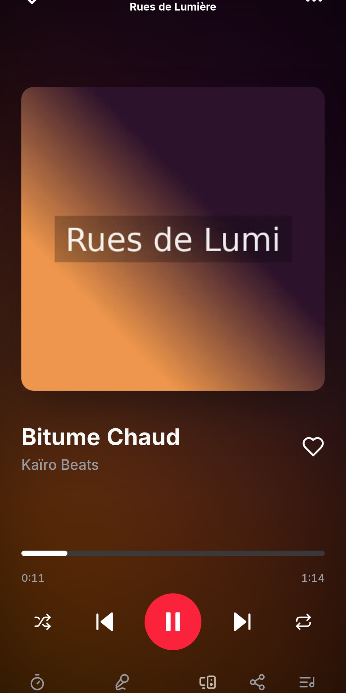
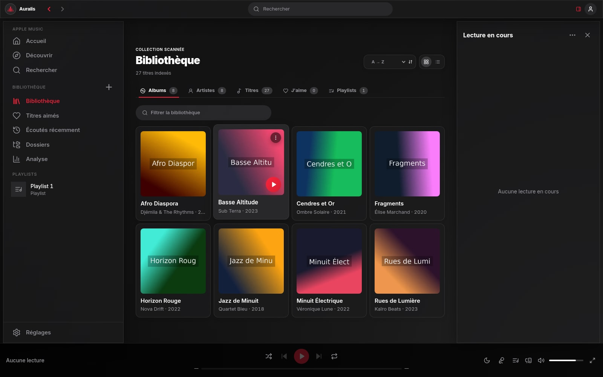

# Auralis

Lecteur de musique auto-hébergé, pensé mobile d'abord. Scannez votre bibliothèque,
écoutez partout : interface tactile complète, PWA installable (Android / iOS),
égaliseur temps réel, paroles synchronisées, radio intelligente — en français et
en anglais, sans le moindre emoji.

> Version mobile retravaillée de fond en comble à partir du projet
> [ybenyedder/auralis](https://github.com/ybenyedder/auralis) — voir
> [Licence](#licence).





## Points forts

**Mobile / PWA**

- Barre d'onglets type Apple Music : 5 onglets distincts (Accueil, Parcourir,
  Radio, Bibliothèque, Recherche) avec état actif fiable et retour haptique.
- Lecteur plein écran : glisser horizontalement pour changer de titre,
  minuterie de sommeil (15/30/60 min ou fin du titre), paroles karaoké avec
  ligne active, poignée de progression adaptée au toucher.
- Media Session : commandes casque / écran de verrouillage / enceintes
  connectées.
- PWA installable : manifeste complet, raccourcis, captures d'écran, service
  worker (mode hors-ligne de l'interface).
- Design 100 % responsive, zones tactiles ≥ 44 px, zones sûres iOS.

**Audio**

- Égaliseur 6 bandes temps réel (8 préréglages + courbes personnalisées,
  persistance par appareil), intégré à la chaîne ReplayGain / analyseur.
- Normalisation du volume (ReplayGain), analyse BPM / énergie, transitions.
- Radio « MoodMix » et suggestions basées sur l'historique d'écoute.

**Bibliothèque**

- Scan automatique (ID3, pochettes, albums, artistes, genres), montage NAS
  possible (polling), fichiers `.lrc` pris en charge.
- Playlists intelligentes, favoris, historique, statistiques d'écoute
  (séries, récapitulatifs mensuels).
- Recherche instantanée avec résultats groupés et recherches récentes.

**Serveur**

- Bilingue FR / EN sur toutes les surfaces (interface, notifications,
  aria-labels) — aucune chaîne codée en dur.
- Docker : installation en 4 commandes, mise à jour en 1 commande
  (`deploy/update.sh`), sauvegarde en 1 commande (`deploy/backup.sh`).
- Prêt Google Play : déclaration Digital Asset Links automatique
  (`/.well-known/assetlinks.json`) — voir [PLAYSTORE.md](PLAYSTORE.md).
- Aucune dépendance externe payante : SQLite embarqué, tout reste sur votre
  serveur.

## Démarrage rapide (développement)

```bash
bun install
cp .env.local.example .env.local   # puis adaptez les chemins
bun run dev                        # http://localhost:3000
```

Variables principales (voir `deploy/.env.example` pour la liste complète) :

| Variable                 | Rôle                                            |
| ------------------------ | ----------------------------------------------- |
| `AURALIS_MUSIC_DIR`      | Dossier scanné (votre musique)                  |
| `AURALIS_DATA_DIR`       | Base SQLite, pochettes, analyses                |
| `AURALIS_ADMIN_PASSWORD` | Mot de passe initial du compte admin            |
| `AURALIS_LYRICS_ONLINE`  | `false` = mode 100 % hors-ligne                 |

Une bibliothèque de démonstration (27 titres) peut être générée avec
`scripts/gen-sample-music.sh`.

## Déployer sur un serveur

Guide complet dans [DEPLOY.md](DEPLOY.md) — en résumé :

```bash
git clone <votre-fork> /opt/auralis
cd /opt/auralis/deploy
cp .env.example .env && nano .env
./update.sh
```

## Publier sur Google Play

La PWA peut être encapsulée (TWA) et publiée sur le Play Store. Toute la
démarche — empreinte SHA-256, `assetlinks.json`, captures réglementaires — est
détaillée dans [PLAYSTORE.md](PLAYSTORE.md).

## Dépôt GitHub

La refonte web mobile vit sur la branche **`mobile-web-v2`** du dépôt
[ybenyedder/auralis](https://github.com/ybenyedder/auralis) (la branche `main`
accueille également le client Android natif). Après fusion dans `main`, la mise
à jour du serveur se limite à :

```bash
cd /opt/auralis && git pull && cd deploy && ./update.sh
```

## Licence

[Auralis Attribution License v1.0](LICENSE) — licence MIT avec attribution
obligatoire, © Youssef Ben yedder. Toute redistribution doit conserver la
mention d'attribution et le présent fichier de licence.
